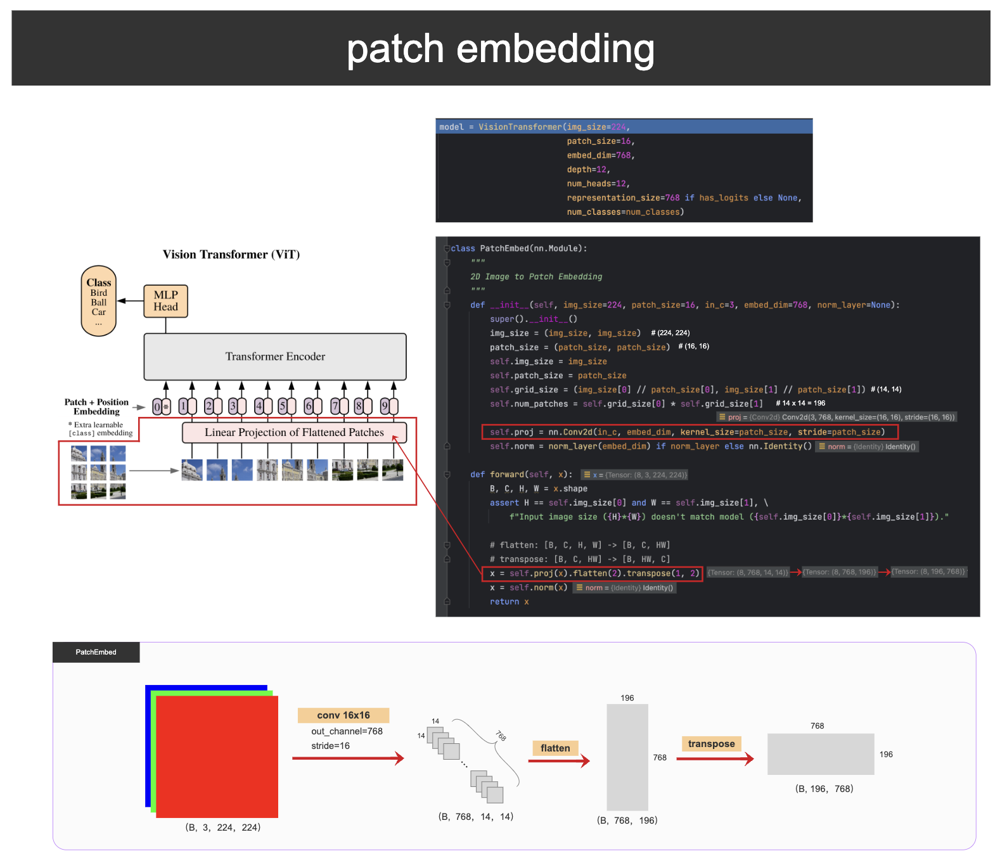
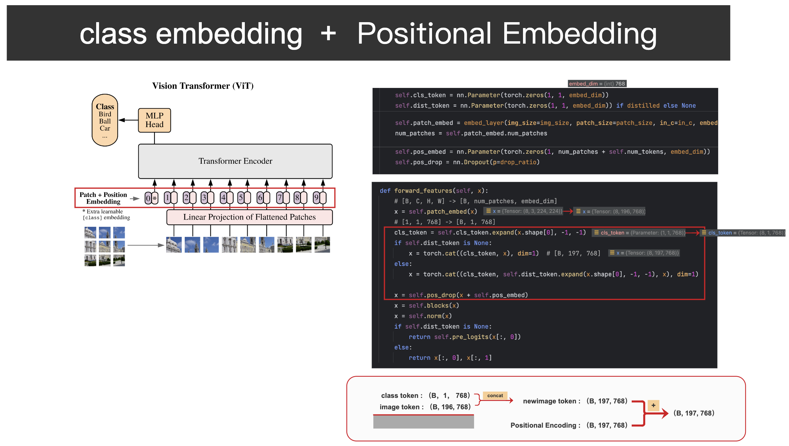
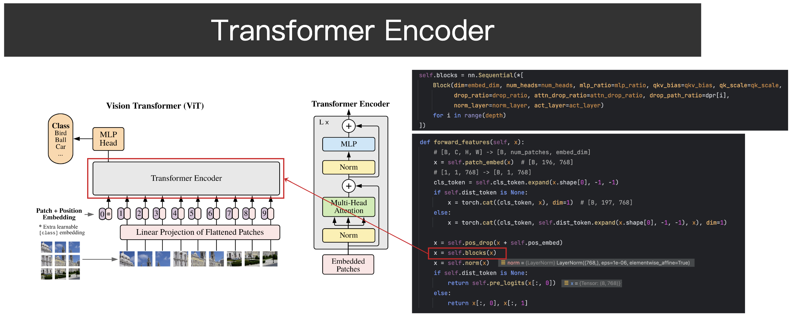
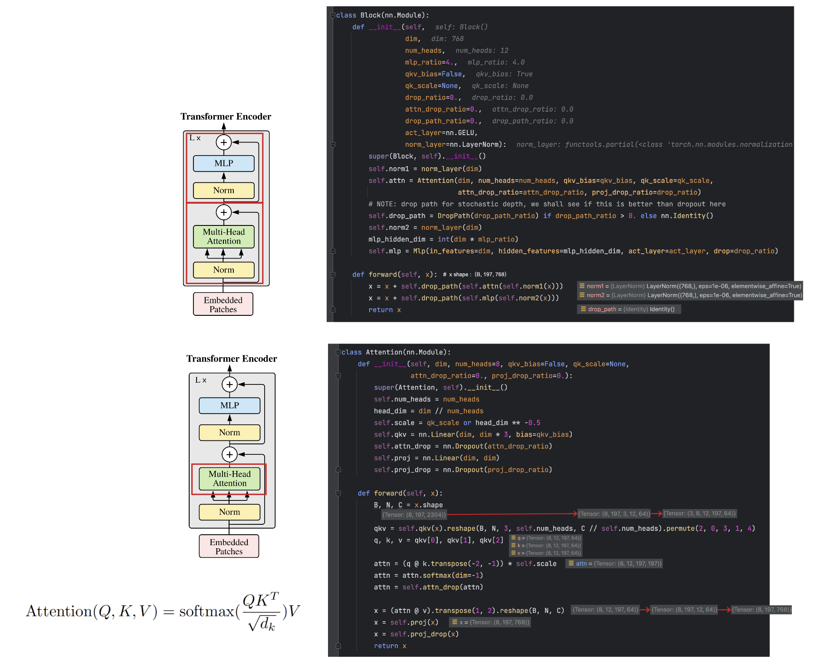

# 1. Using
* Dataset 
   Flower classification: [https://storage.googleapis.com/download.tensorflow.org/example_images/flower_photos.tgz](https://storage.googleapis.com/download.tensorflow.org/example_images/flower_photos.tgz) 

* Pre-trained parameters   \
   Pre-trained parameters: [vit_base_patch16_224](https://github.com/rwightman/pytorch-image-models/releases/download/v0.1-vitjx/jx_vit_base_patch16_224_in21k-e5005f0a.pth) \
   
* Training \
   run the train.py file

* Prediction \
   run the predict.py file
# 2. Explaination
* Patch embedding

* Class and positional embedding

* ViT encoder 

